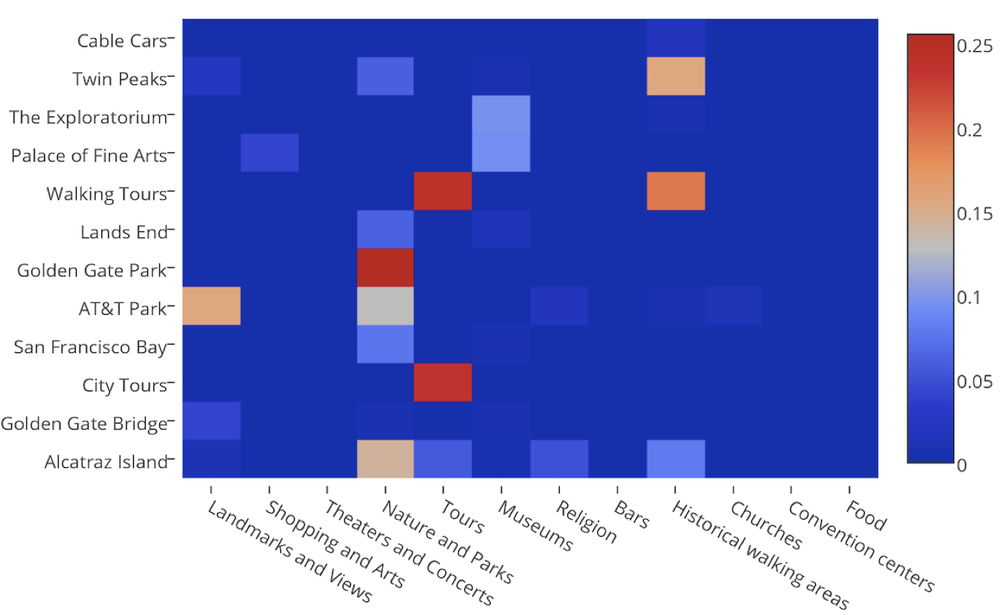

# SmarTrip
2-week capstone project at Galvanize

## Overview
No matter when we visit a new city or spend our weekends at our current city, we want to find the best attractions or 'Things to Do' which are fun and fit our interests. Travel websites usually rank attractions only by popularity (ratings and number of reviews), making it hard to find lots of attractions. For example, in TripAdvisor, Fisherman's Wharf is ranked No.38/525 things to do in San Francisco, you need some efforts to search and see it in the middle of 2nd page.

SmarTrip will guide you and recommend you attractions based on your interest and its contents. SmarTrip label all the attractions in San Francisco into 12 topics using topic modeling, it also combines the distance data of different attractions and will recommend aggregated attractions to you.

## Data Source
All attractions were scraped from TripAdvisor, with attraction name, description, address, average ratings and number of reviews for each city. In addition, users, reviews and ratings are scrapedfor each attraction. Longitude, latitude data and distance matrix are obtained from Google geocoder using the address data from TripAdvisor.

## Data Pipeline and Modeling
Attraction descriptions are scraped from TripAdvisor, NaN data are filled with attraction names and categories and feature engineering is performed. Description data were lowercased, tokenized, with stop words removed and stemized, using NLTK packages, then the tokenized text were vectorized to tfidif using TfidfVectorizer from scikit-learn. Topic modeling was done with KMeans clustering, NMF and LDA, all using packages from scikit-learn.

Results were evaluated by calculating the cosine similarity matrix (scikit-learn linear_kernel) and manual filtering. NMF gives best results here and chosen as the final model.

Address data were collected, NaN rows were dropped, latitude and longitude data were obtained from google geocoder with the addresses, and distance matrix were calculated.

User-item rating data (the utility matrix) were collected from TripAdvisor, with more than 132,000  ratings and reviews in english for 388 attraction items and more than 56,000 distinct users.  Item matrix were created using the attraction name and description from the attraction data. The 2 mismatched items between the utility matrix and item rating matrix is due to 2 non-english reviews, which were removed. Item matrix were vectorized to tfidf matrix for the modeling.

Graphlab was used for the collaborative filtering based recommendation, with the item matrix with item features for the content boosting. Item similarity recommender was compared with matrix factorization recommender, with the factorization recommender gives lower rmse, most likely due to the sparse matrix nature of the user-item matrix. This recommender provides rating for all the existing users. For cold-start problem (new users), they were recommended with the top recommended item.

Final recommendation model was built with two type of choices for users:
* If you are existing user and have rated attractions, the system will predict what you like based on your similarity to other TripAdvisor users. With your input of your username, a recommendation list will pop out.

* If you are new user, the system let you choose the topic interest you from a group of 12 topics, and recommend places to you, ranked by the popularity, with their locations close to each other.

## webapp
A web app is built with Python Flask, html, css and JavaScript:

## Tools and Packages used

#### Stack:

* python
* git
* markdown

#### Web Scraping:

* requests
* beautiful soup
* json
* pickle

#### Databasing:

* mongodb
* pymongo
* AWS EC2 & S3

#### Feature Engineering:

* NLTK
* regex

#### Modeling:

* numpy
* pandas
* scikit learn
* graphlab

#### Machine learning
* Natural language processing
* Recommender system
* TFIDF, NMF, LDA

#### Data visualization:

* matplotlib
* seaborn
* plotly
* D3

#### Web App:

* Flask
* Bootstrap
* html
* css
* JavaScript

## Future work
* Graph attractions with nodes as attractions and edges as their similarity and scores
* Expand the app to other cities in the US with same data from TripAdvisor
